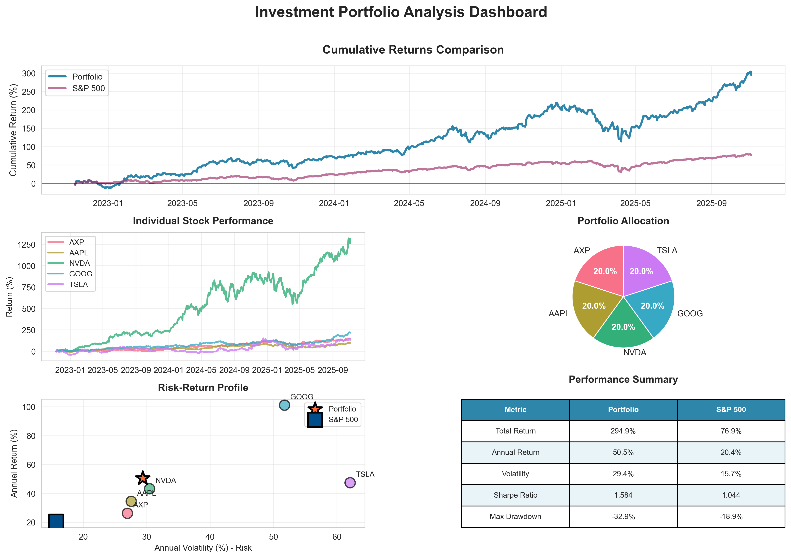

# Investment Portfolio Analysis Tool

A comprehensive Python tool for analyzing stock portfolios, calculating risk-adjusted returns, and generating professional performance visualizations. Benchmarks portfolio performance against the S&P 500 and provides detailed metrics including Sharpe ratio, alpha, beta, and maximum drawdown.

## Features

- **Multi-Stock Portfolio Analysis**: Analyze portfolios with any number of stocks with customizable weights
- **Performance Metrics**: Calculate comprehensive metrics including:
  - Total and annual returns
  - Annual volatility
  - Sharpe ratio (risk-adjusted returns)
  - Maximum drawdown
  - Alpha and Beta (CAPM metrics)
- **Benchmark Comparison**: Compare portfolio performance against S&P 500
- **Professional Visualizations**: Generate comprehensive dashboard with:
  - Cumulative returns comparison
  - Individual stock performance
  - Portfolio allocation pie chart
  - Risk-return scatter plot
  - Performance metrics table
- **Real-Time Data**: Fetches live market data from Yahoo Finance

## Installation

1. Clone the repository:
```bash
git clone https://github.com/felixsavedra-1/investment-portfolio-analysis.git
cd investment-portfolio-analysis
```

2. Create a virtual environment:
```bash
python -m venv venv
source venv/bin/activate  # On Windows: venv\Scripts\activate
```

3. Install dependencies:
```bash
pip install -r requirements.txt
```

## Usage

### Basic Usage

Run the analysis with default settings (5 stocks with equal weights):

```bash
python src/portfolio_analysis.py
```

### Custom Portfolio

Modify the `main()` function in `src/portfolio_analysis.py` to customize your portfolio:

```python
from portfolio_analysis import PortfolioAnalyzer

# Define your portfolio
tickers = ['AAPL', 'GOOGL', 'MSFT', 'AMZN', 'TSLA']
weights = [0.3, 0.2, 0.2, 0.15, 0.15]  # Optional: custom weights

# Create analyzer
analyzer = PortfolioAnalyzer(
    tickers=tickers,
    weights=weights,  # Optional: defaults to equal weights
    start_date='2020-01-01',  # Optional: defaults to 3 years ago
    end_date='2024-01-01'     # Optional: defaults to today
)

# Run complete analysis
analyzer.run_analysis()
```

### Using the PortfolioAnalyzer Class

```python
from portfolio_analysis import PortfolioAnalyzer
from datetime import datetime

# Initialize analyzer
analyzer = PortfolioAnalyzer(
    tickers=['AAPL', 'NVDA', 'GOOG'],
    weights=[0.4, 0.3, 0.3],
    start_date='2022-01-01',
    end_date='2024-01-01'
)

# Run individual analysis steps
analyzer.fetch_data()
analyzer.calculate_returns()
analyzer.calculate_metrics()
analyzer.print_results()
analyzer.plot_performance(save_path='my_portfolio.png')
```

## Output

The tool generates:

1. **Console Output**: 
   - Portfolio composition
   - Performance metrics comparison
   - Key insights

2. **Visualization**: 
   - `portfolio_analysis.png`: Comprehensive dashboard with all visualizations

### Example Visualization



## Metrics Explained

- **Total Return**: Cumulative return over the analysis period
- **Annual Return**: Average annualized return
- **Annual Volatility**: Standard deviation of returns (risk measure)
- **Sharpe Ratio**: Risk-adjusted return measure (higher is better)
- **Max Drawdown**: Largest peak-to-trough decline
- **Beta**: Sensitivity to market movements (1.0 = moves with market)
- **Alpha**: Excess return over benchmark after adjusting for risk

## Requirements

- Python 3.8+
- pandas >= 2.0.0
- numpy >= 1.24.0
- yfinance >= 0.2.28
- matplotlib >= 3.7.0
- seaborn >= 0.12.0
- scipy >= 1.10.0

## Project Structure

```
investment-portfolio-analysis/
├── src/
│   └── portfolio_analysis.py  # Main analysis tool
├── requirements.txt            # Python dependencies
├── README.md                   # This file
└── .gitignore                  # Git ignore rules
```

## Example Output

```
📊 PORTFOLIO COMPOSITION
  AXP    :  20.0%
  AAPL   :  20.0%
  NVDA   :  20.0%
  GOOG   :  20.0%
  TSLA   :  20.0%

📈 PERFORMANCE METRICS
Total Return                          294.93%              76.89%
Annual Return                          50.53%              20.43%
Sharpe Ratio                             1.584                1.044
```

## License

This project is open source and available under the MIT License.

## Contributing

Contributions, issues, and feature requests are welcome!

## Author

Felix Savedra - [GitHub](https://github.com/felixsavedra-1)

